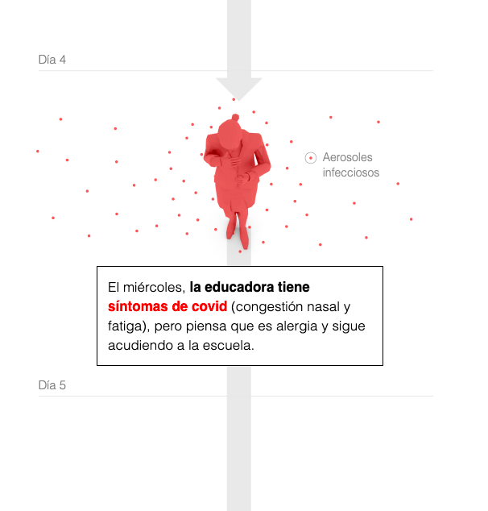
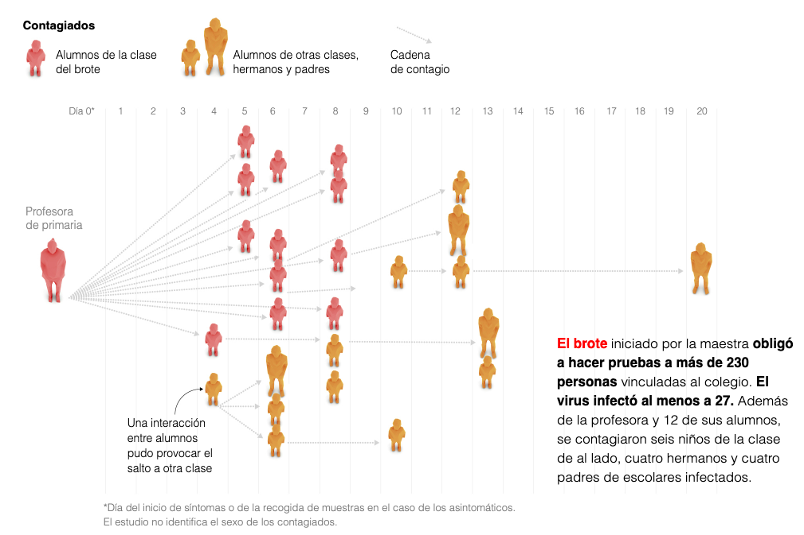

# COMENTARIO SOBRE LA INFOGRAFIA 'EL CASO DE LOS 12 NIÑOS CONTAGIDOS DE COVID POR SU PROFESORA'

El presente comentario pretende analizar la infografía publicada en el diario *El País* el 12 de septiembre de 2021, la cual detalla el proceso por el cual una profesora contagió a 12 de sus alumnos e inició un brote de la variante Delta de coronavirus que afectó a 27 personas.

## DESCRIPCIÓN
La primera infografía recogida en el artículo del periódico refleja cómo fue el **proceso de infección y transmisión del virus de la maestra hacia los estudiantes**. Aunque en la imagen indexada sólo se vean los dibujos, en el artículo (elpais.com/ciencia/2021-09-12/el-caso-de-los-12-niños-contagiados-de-covid-por-su-profesora-lecciones-para-la-vuelta-al-cole.html) los dibujos van acompañados de explicaciones y una línea temporal que detalla paso por paso (por días) cómo se produjo la infección directa. 

Esta es la infografía más grande y llamativa de las que acompañan al artículo, que cuenta con una serie de elementos que configuran como completa y detallada:
- **Texto**: la información más relevante aparece insertada en cuadros y resaltada en negrita y en rojo, orientando al lector. Además, se incluyen en una tonalidad más clara junto a las ilustraciones para explicar lo que muestran.
- **Imágenes**: son sencillas, basadas en modelaciones 3D, e ilustran de una forma clara lo enunciado en los cuadros de texto. La gama de colores es de gris y se emplea el rojo para resaltar qué partes del dibujo están "infectadas" de COVID.
- **Línea temporal**: los dibujos representan la sucesión de pasos que durante 7 días llevaron a la infección de la mitad de la clase. Por ello, las imágenes se van sucediendo a lo largo de una serie de puntos denominados: "Día 1", "Día 2", "Dia 3", etc.
- **Conectores visuales**: unas sencillas flechas grises van guiando al lector de ilustración en ilustración.

A continuación se muestra una de las imégenes de esta primera infografía, para que se pueda apreciar la convergencia de los elementos anteriormente expuestos. 

La siguiente infografía recogida en el árticulo de *El País* muestra cómo se produjo la **cadena de contagio de la profesora a los alumnos y de éstos a otros compañeros y padres** atendiendo también a la información cronológica. Se sitúa una figura por cada infectado en el día en que se produjo la infección y mediante flechas se unen los portadores con las personas a las que contagiaron. Además, los colores de las figuras varían en función de si eran alumnos pertenecientes a la clase infectada (rojo) o si eran agentes externos que tuvieron contacto con ellos (amarillo). Por otra parte, se diferencia si los afectados eran niños o adultos gracias al tamaño de las figuras, que es más grande para aquellas que representan a padres de alumnos y a la profesora. 

Esta segunda infografía se vale de los mismos alementos que la anterior, pero su combinación y disposición es notablemente diferente ya que, si bien la primera adquiere la apariencia de un eje cronológico de los distintos pasos en la transmisión del virus, ésta se configura más bien como un *mapa de árbol* que refleja cómo son las conexiones entre los afectados por la infección.

La tercera infografía de esta pieza periodística refleja el **periodo contagioso de las personas contagiadas por la variante Delta de la COVID 19**, ejemplificado en el caso de la profesora de primaria. El procedimiento para ilustrar esta información es el mismo que en las anteriores infografías: imágenes sencillas de la silueta de la maestra, acompañadas de texto y elementos de representación visual como vectores y flechas. En esta infografía se incluye además una representación gráfica del pico infeccioso de los afectados por coronavirus, por lo que esta infografía tiene un *carácter más estadístico* que las anteriores.

Después se muestra una infografía mucho más sencilla, que refleja **qué medidas de contención** se habían adoptado por parte de los implicados para prevenir la infección. En este caso, se muestran miniaturas que representan las diferentes medidas recomendadas por los expertos para evitar la propagación del virus y se indica si se cumplieron (v) o no (x). Se aprecia que al tratarse de una de las últimas infografías del artículo, su grado de relevancia no es tan grande con el de las anteriores, de ahí su menor tamaño y mayor sencillez en el diseño.

A continuación se incluyen unos gráficos interactivos que no van a ser objeto de análisis en este comentario por no seguir la estética y diseño del resto de infografías del artículo y por contar con un único elemento para plasmar la información (la representación gráfica). Sin embargo, sí hay que detenerse en la última de las infografías de esta pieza de *El País*, por tratarse de un cierre que *pretende hacer reflexionar al lector*.

En ella, se muestra de forma esquemática la **distribución de los contagiados en la clase de la profesora de primaria estadounidense** y se hace una **comparación con una clase en España**. La infografía refleja (mediante los elementos ya explicados anteriormente) cómo en una clase con una distancia de seguridad de 1'8 metros entre pupitres se produjo el contagio de la mitad de los alumnos. Al lado de esta representación esquematizada se incluye la de una clase española, que cuenta con una separación entre mesas de 1'2 metros. *Sin necesidad de mencionarlo explícitamente*, el lector comprende que, si en Estados Unidos se contagiaron la mitad de alumnos de la clase, en España, donde la distancia es aún menos, el riesgo es mucho más alto. De esta manera se conecta con el título del artículo: *Lecciones para la vuelta al colegio*

