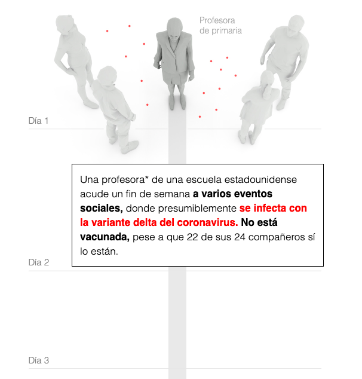
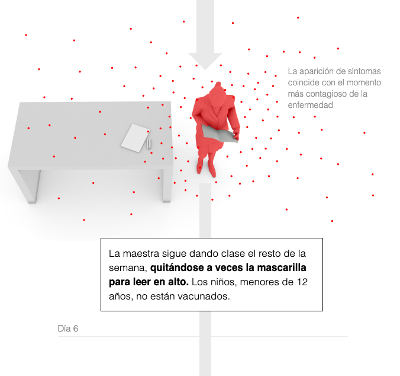
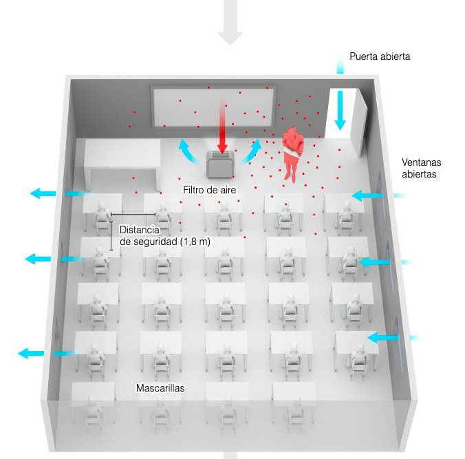
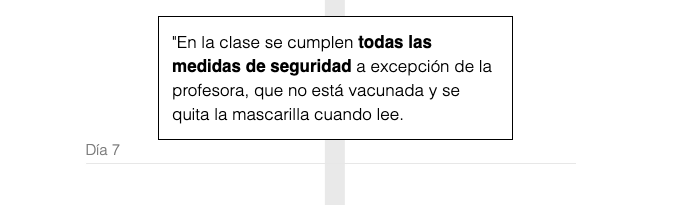
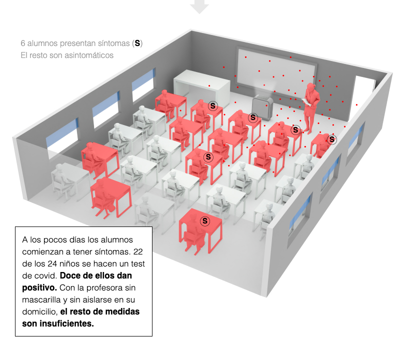

# COMENTARIO SOBRE LA INFOGRAFIA 'EL CASO DE LOS 12 NIÑOS CONTAGIDOS DE COVID POR SU PROFESORA'
El presente comentario pretende analizar la infografía publicada en el diario *El País* el 12 de septiembre de 2021, la cual detalla el proceso por el cual una profesora contagió a 12 de sus alumnos e inició un brote de la variante Delta de coronavirus que afectó a 27 personas. La primera infografía recogida en el artículo del periódico refleja cómo fue el proceso de infección y transmisión del virus de la maestra hacia los estudiantes. 

