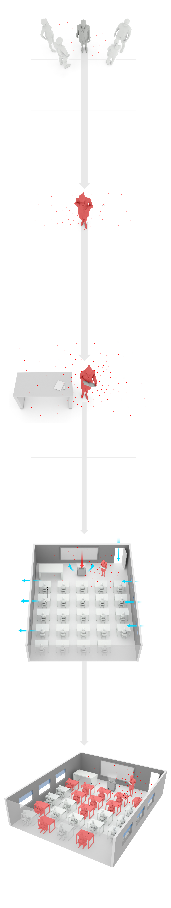

# COMENTARIO SOBRE LA INFOGRAFIA 'EL CASO DE LOS 12 NIÑOS CONTAGIDOS DE COVID POR SU PROFESORA'
El presente comentario pretende analizar la infografía publicada en el diario *El País* el 12 de septiembre de 2021, la cual detalla el proceso por el cual una profesora contagió a 12 de sus alumnos e inició un brote de la variante Delta de coronavirus que afectó a 27 personas.
La primera infografía recogida en el artículo del periódico refleja cómo fue el **proceso de infección y transmisión del virus de la maestra hacia los estudiantes. Aunque en la imagen indexada sólo se vean los dibujos, en el artículo (elpais.com/ciencia/2021-09-12/el-caso-de-los-12-niños-contagiados-de-covid-por-su-profesora-lecciones-para-la-vuelta-al-cole.html) los dibujos van acompañados de explicaciones y una línea temporal que detalla paso por paso (por días) cómo se produjo la infección directa. 

Esta es la infografía más grande y llamativa de las que acompañan al artículo, que cuenta con una serie de elementos que configuran como completa y detallada:
- **Texto**: la información más relevante aparece insertada en cuadros y resaltada en negrita y en rojo, orientando al lector. Además, se incluyen en una tonalidad más clara junto a las ilustraciones para explicar lo que muestran.
- **Imágenes**: son sencillas, basadas en modelaciones 3D, e ilustran de una forma clara lo enunciado en los cuadros de texto. La gama de colores es de gris y se emplea el rojo para resaltar qué partes del dibujo están "infectadas" de COVID.
- **Línea temporal**: los dibujos representan la sucesión de pasos que durante 7 días llevaron a la infección de la mitad de la clase. Por ello, las imágenes se van sucediendo a lo largo de una serie de puntos denominados: "Día 1", "Día 2", "Dia 3", etc.
- **Conectores visuales**: unas sencillas flechas grises van guiando al lector de ilustración en ilustración.
A continuación se muestra una de las imégenes de esta primera infografía, para que se pueda apreciar la convergencia de los elementos anteriormente expuestos. 

