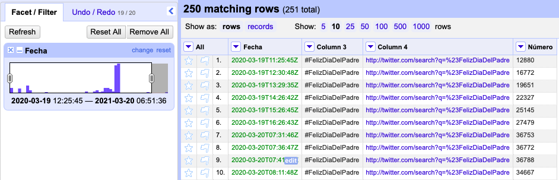
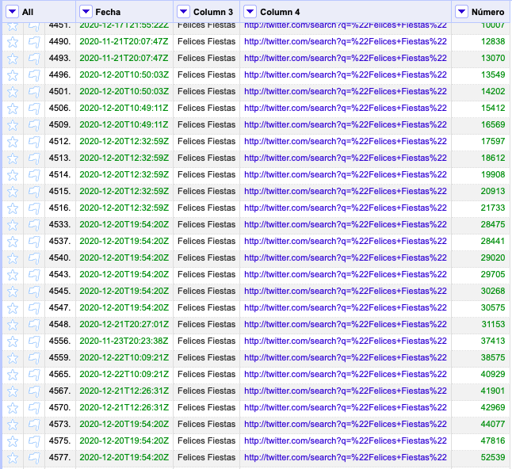
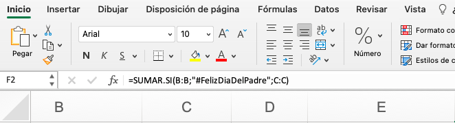
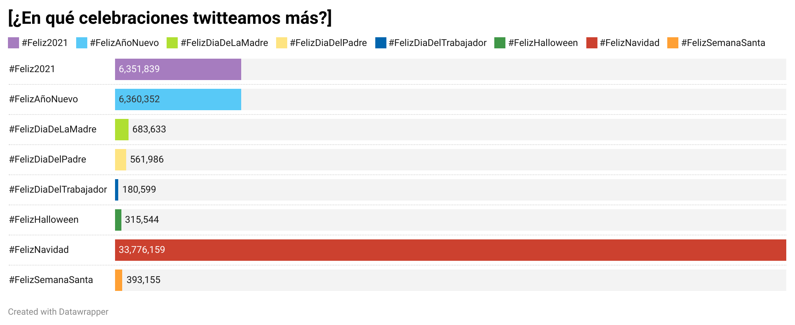
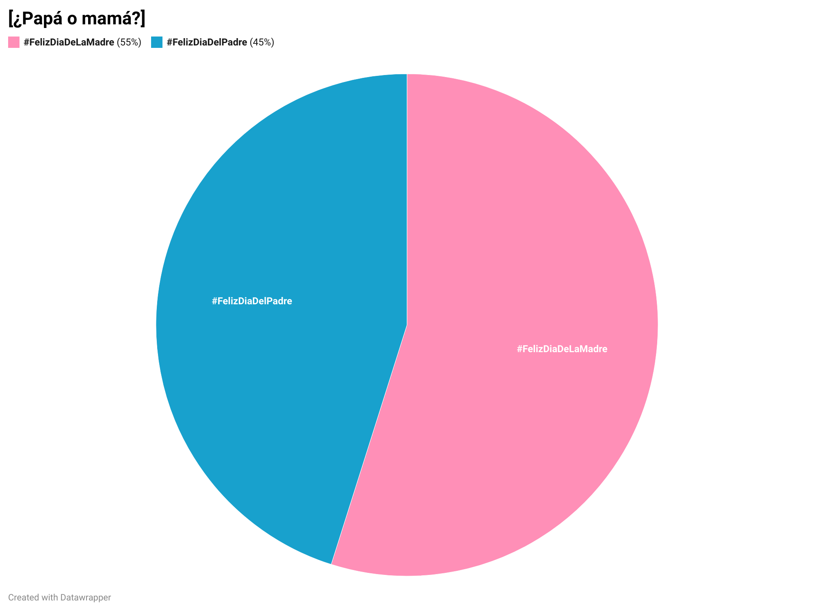

# ¿Qué celebraciones tienen más peso en Twitter?

El presente trabajo presenta los resultados del tratamiento de los datos de *TRESCA*, que muestran las publicaciones relacionadas con la felicidad en Twitter en un periodo de tiempo concreto. En mi caso, se presentarán datos relacionados con el número de tweets publicados en las diferentes fiestas y celebraciones en España. Para obtener el resultado final, se ha trabajado con OpenRefine, Excel y Datawrapper.

## Preparación de los datos

En OpenRefine he realizado una selección de los datos que me parecían más interesantes para mis gráficos. Así, se han descartado todos los *hashtags* que no tuviesen relación con festividades o celebraciones. Además, mediante la opción de *cluster* se han unido todos los tweets que hacían referencia al mismo acontecimiento y se ha editado el nombre de algunas publicaciones, como por ejemplo *Feliz y Santa Navidad* para a agruparlas en la misma categoría, en este caso *#FelizNavidad*. Por otra parte, se han acotado los datos que figurarán en los gráficos a un año mediante una *faceta de línea del tiempo*, puesto que así no se corría el riesgo de contabilizar los datos de dos años en algunas festividades.

Por otra parte, dado que para el trabajo que se pretendía exponer lo más relevante era la cantidad de veces que se había twitteado sobre un tema, se elimaron también las filas cuyo número de tweets no apareciese. Para ello, se ha empleado una *faceta por datos nulos*, que separa filas en blanco y rellenas. 

Una vez llevada a cabo esta parte del proceso era necesario un paso intermedio entre el trabajo con OpenRefine y Datawrapper. Mediante la ayuda de Excel, se han sumado el número de tweets de cada hashtag, para obtener así el total de publicaciones sobre un mismo tema en el periodo de tiempo de un año.

Mediante la fórmula SUMAR.SI se ha llevado a cabo un sumatorio del total de tweets de cada hashtag, hasta obtener ocho valores diferentes:
- #Feliz2021
- #FelizAñoNuevo
- #FelizDiaDeLaMadre
- #FelizDiaDelPadre
- #FelizDiaDelTrabajador
- #FelizHalloween
- #FelizNavidad
- #FelizSemanaSanta

## Presentación de los datos

### ¿Cuándo deseamos unas #FelicesFiestas en Twitter?

El primer gráfico muestra la evolución del hashtag #FelicesFiestas en la red social y refleja que las interacciones con este tema comienzan a finales de noviembre y se disparan a mediados de diciembre, por lo que vemos que no se corresponde exclusivamente con la Navidad cristiana.

Se ha escogido un gráfico lineal para ilustrar estos datos, porque este tipo de representación es la que mejor refleja patrones y tendencias, de tal manera que posibilita el análisis de cómo un tipo de dato ha ido cambiando a lo largo del tiempo. En este caso, muestra cómo han ido variando las publicaciones de Twitter relativas a un tema en un intervalo temporal. 

### ¿En qué celebraciones twitteamos más?

El siguiente gráfico muestra cuáles son las celebraciones en las que la gente desea un feliz devenir de las mismas al resto de usuarios en Twitter. Vemos que la Navidad le lleva una clara ventaja al resto, seguida del Año Nuevo y, relacionado también con esta celebración, el 2021. En el caso de la Semana Santa, se aunaron todos los hashtags de las diferentes festividades semanales en uno solo para hacer un recuento general de este acontecimiento. 

Los datos se recogen en un gráfico de barras, porque éste facilita la comparación de diferentes categorías de la forma más sencilla posible y, al no haber un número elevado de tipos de mensajes, la presentación no resulta recargada y difícil de comprender.

### ¿Papá o mamá?

Este gráfico refleja la diferencia en el número de tweets de felicitación subidos el Día del Padre y el Día de la Madre. Vemos que hay una ligera diferencia en los tweets publicados ambos días, con las madres en primera posición para recibir el amor filial por la red social Twitter.

La elección del gráfico circular se justifica porque éste permite al lector obtener una rápida idea sobre la distribución proporcional de los datos. Al tratarse de una comparación en base al género, existen sólo dos categorías, por lo que los datos se entienden de forma precisa e instantánea.

