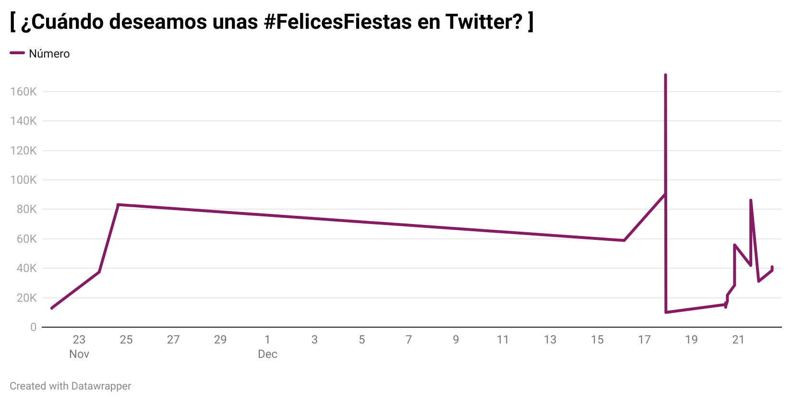
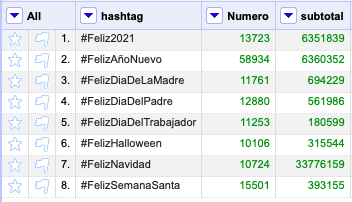

# ¿Qué celebraciones tienen más peso en Twitter?

El presente trabajo presenta los resultados del tratamiento de los datos de *TRESCA*, que muestran las publicaciones relacionadas con **la felicidad en Twitter** en un periodo de tiempo concreto. En este caso, se presentarán datos relacionados con el número de tweets publicados en las diferentes **fiestas y celebraciones en España**. Para obtener el resultado final, se ha trabajado con *OpenRefine y Datawrapper*.

## Presentación de los datos

Las redes sociales han pasado a ser un aspecto central de nuestro día a día, y Twitter no es una excepción. Acudimos a ella para contar cómo nos sentimos: enfadados, tristes, inseguros, animados, felices... y para transmitir esas emociones al resto de usuarios. Las demostraciones de amor y felicidad son una constante en la red y muchos no pierden el tiempo cuando llega una fecha señalada para felicitarle el día al resto de twitteros, por lo que en algunos momentos del año esta red social se llena de mensajes que transmiten los buenos deseos de los usuarios para con sus seguidores. Atendiendo a las dinámicas que se generan en cuanto a interacción con las fiestas y celebraciones en España, se puede arrojar una imagen sobre cuáles son las preferencias de los usuarios de la red social Twitter a la hora de felicitar las festividades a sus compañeros.

El "hashtag" por antonomasia en lo que se refiere a este tema es el de #FelicesFiestas. Se aprecia que su uso comienza a finales de noviembre y va manteniéndose constante hasta mediados de diciembre, cuando hay un pico de notable intensidad, seguido de un descenso notable. Aunque en España la religión mayoritaria sea la católica, vemos que se empieza twittear #FelicesFiestas un mes antes de que comiencen las festividades nadideñas propiamente dichas.

Aunque se pueda pensar que esto es extraño, lo cierto es que tanto Hanukkah como Acción de gracias tienen lugar a finales de noviembre, por lo que se le puede atribuir a estas fiestas procedentes de otros países y de religiones con menor presencia en el país la aparición temprana del "hashtag". Esto demuestra que lo que la población considera el periodo tradicional de fiestas empieza mucho antes de lo que se podría imaginar en un primer momento y no abarca sólo los ritos cristianos, sino que también comprende otras culturas y tradiciones.

Sin embargo, si se atiende al número de "tweets" publicados por cada "hashtag" concreto, es evidente que la Navidad es la indiscutible protagonista de las fiestas para los españoles, al menos en redes sociales. 

A continuación de la Navidad, las fiestas más twitteadas son el Año Nuevo y el 2021, por lo que se aprecia que las felicitaciones festivas en Twitter se concentran en el periodo de finales de diciembre y principios de enero. Podría entenderse que esto se debe a un mayor tiempo para twittear durante las vacaciones, pero en Semana Santa también hay días no laborables y sus cifras están muy por detrás. Se puede concluir por tanto que el espíritu que se respira durante esta época del año puede animar a los usuarios a compartir su alegría y esperanzas con el resto de internautas.

Este estado de ánimo colectivo no se debe únicamente al carácter religioso de la Navidad, ya que la celebración del nuevo año no tiene un componente cristiano. Además, como ya se ha señalado anteriormente, la Semana Santa, la festividad más importante del cristianismo, ni se acerca a las interacciones de estas otras fiestas. En este sentido, hay que precisar que para hacer el recuento de los "tweets" publicados para felicitar la Pascua se aunaron los "hashtags" de todas las diferentes festividades semanales en uno solo para hacer un recuento general de esta celebración religiosa.

Por lo tanto, se aprecia que a la hora de felicitar los diferentes tipos de fiestas en España en Twitter, los usuarios se dejan guiar más por el sentimiento que provocan en ellos las diferentes celebraciones que por la tradición. En lo relativo a este aspecto y relacionado con la incorporación a las costumbres de los españoles de festividades extranjeras, destaca también la aparición de Halloween entre las fiestas que más interacciones suman. Tratándose de una celebración anglosajona, que no tenía una presencia relevante en España hace unas décadas, es notable su presencia entre los "hashtags" más empleados por los españoles, mientras que la festividad tradicional del Día de Todos los Santos -la que se celebra tradicionalmente en España- no cuenta con el mismo seguimiento.

Por último, hay que atender concretamente a la diferencia de interacciones en los hashtags de #FelizDiaDeLaMadre y #FelizDiaDelPadre.

Vemos que hay una diferencia en los "tweets" publicados ambos días, con las *madres en primera posición* para recibir el amor filial por la red social Twitter. Esto refleja que, aunque en los últimos años se haya avanzado en materia de igualdad en pareja, se sigue apreciando que existe una mayor conexión con las madres, o al menos así se refleja en Twitter.

## El tratamiento de los datos

En **OpenRefine** se ha realizado una *selección de los datos* que resultaban más interesantes para estos gráficos. Así, se han descartado todos los "hashtags" que no tuviesen relación con festividades o celebraciones. Además, mediante la opción de "cluster" se han unido todos los "tweets" que hacían referencia al mismo acontecimiento y se ha editado el nombre de algunas publicaciones, como por ejemplo *Feliz y Santa Navidad* para a agruparlas en la misma categoría, en este caso *#FelizNavidad*. Por otra parte, se han acotado los datos que figurarán en los gráficos a un año mediante una *faceta de línea del tiempo*, puesto que así no se corría el riesgo de contabilizar los datos de dos años en algunas festividades.

Por otra parte, dado que para el trabajo que se pretendía exponer lo más relevante era la cantidad de veces que se había twitteado sobre un tema, se eliminaron también las filas cuyo número de "tweets" no apareciese. Para ello, se ha empleado una *faceta por datos nulos*, que separa filas en blanco y rellenas. 

En el caso de los datos sobre la progresión en el tiempo de #FelicesFiestas el refinado de datos mediante OpenRefine estaba listo. Sin embargo, para los otros dos gráficos se necesitaba realizar un sumatorio de todas las veces que se había twitteado cada uno de los hashtags. Para ello, se eliminó la columna de las fechas, puesto que lo que se quería mostrar era la cantidad de "tweets" publicados a lo largo de todo un año, independientemente del momento en el que se hubiesen escrito. A continuación, en la columna en la que figuraban los diferentes hashtags se aplicó un *blankdown* que hizo que se quedasen sólo 8 valores:

- #Feliz2021
- #FelizAñoNuevo
- #FelizDiaDeLaMadre
- #FelizDiaDelPadre
- #FelizDiaDelTrabajador
- #FelizHalloween
- #FelizNavidad
- #FelizSemanaSanta

Una vez hecho esto, sobre la columna en la que figuraba desglosado el número de "tweets" que se habían publicado por cada "hashtag", se añadió otra columna en base a ella, utilizando la fórmula: **row.record.cells['Numero'].value.sum()**. De esta manera y aplicando una faceta de texto sobre la columna en la que aparecían los "hasghtags" se consiguió un recuento del total de tweets publicados sobre un mismo tema.

Habiendo acotado los datos mediante OpenRefine, en **Datawrapper** se editaron los gráficos siguiendo una serie de criterios para la elección del tipo de gráfico más adecuado para cada caso.

### Justificación de la elección de los gráficos

1. Se ha escogido un **gráfico lineal** para ilustrar los datos sobre la **progresión del "hashtag" Felices Fiestas**, porque este tipo de representación es la que mejor refleja *patrones y tendencias*, de tal manera que posibilita el *análisis de cómo un tipo de dato ha ido cambiando a lo largo del tiempo*. En este caso, muestra cómo han ido variando las publicaciones de Twitter relativas a un tema en un intervalo temporal. 

2. Los datos realtivos al **número de "tweets" publicados en cada festividad** se recogen en un **gráfico de barras**, porque éste facilita la *comparación de diferentes categorías* de la forma más sencilla posible y, al no haber un número elevado de tipos de mensajes, la presentación no resulta recargada y difícil de comprender. Aunque Datawrapper dé por defecto al gráfico un estilo monocromático de una gama de colores similares, se ha personalizado el estilo para presentarlo con *colores distintos, que no se puedan confundir entre ellos*, para que la visualización sea lo más sencilla posible.

3. La elección del **gráfico circular** para la **comparación de "tweets" del Día de la Madre y del Día del Padre** se justifica porque éste permite al lector obtener una rápida idea sobre la *distribución proporcional de los datos*. Al tratarse de una comparación en base al género, existen sólo dos categorías, por lo que los datos se entienden de forma precisa e instantánea. Además, se han escogido los colores que se asignan tradicional y popularmente a cada uno de los géneros, para que el *mensaje se capta al instante*, con la primera visualización.
